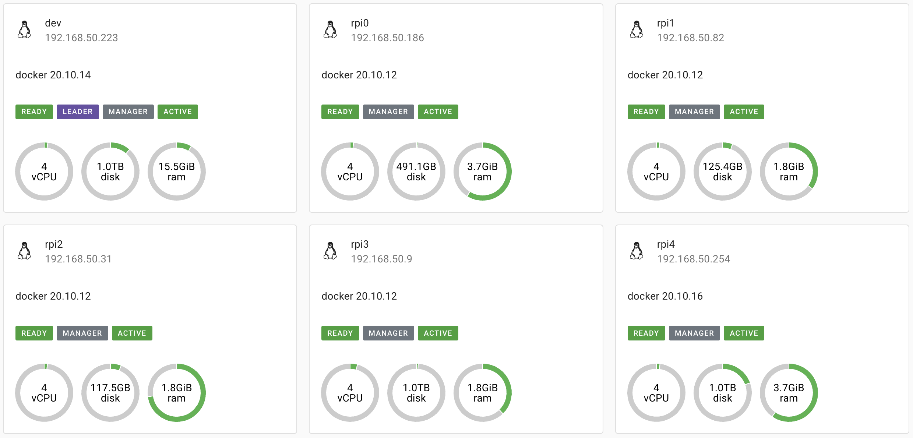

# Server service configs and tools

## Description

This repository contains configuration (docker-compose.yml files) to set up the services I run on my home server. As well as, some useful scripts in the `./scripts` directory.

## Service configs

I currently use the following services on my home server.

| Service              | Purpose                                                   |
|----------------------|-----------------------------------------------------------|
| Drone CI and runners | CI/CD                                                     |
| Droppy               | File storage                                              |
| Resilio Sync         | Real-time peer to peer syncing                            |
| Swarmpit             | Monitor resources                                         |
| Traefik              | Reverse proxy                                             |

## Current nodes in the Swarm cluster

## Scripts

### `backup.sh`

Make backups of important directories into tarballs.

### `update_container.sh`

Update redeploy (update) containers.

### `force_rebalance.sh`

Simply force a rebalance of the Swarm on all the services. Can be automated, will rebalance only if the numbers of tasks running on each server is skewed.

Should not be run too often and only when necessary.

### `ddns-start`

Modified version of @alphabt's project [asuswrt-merlin-ddns-cloudflare](https://github.com/alphabt/asuswrt-merlin-ddns-cloudflare) to suit my usage.

More reference: <https://gist.github.com/dd-han/09853f07efdf67f0f4af3f7531ac7abf>

### `start_pfsense.sh`

Starts the headless virtualbox.

Was used previously when I was running pfSense in a virtualbox as the router.

### `get_dhcp.sh`

Assures the enp2s0 interface has a local IP.
